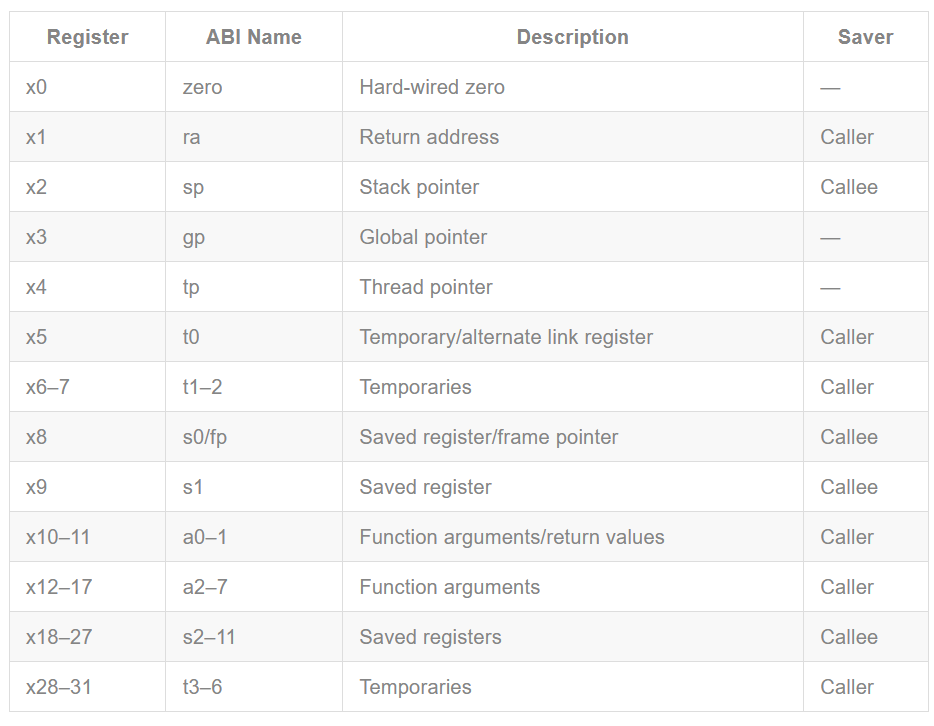

## Challenge1

```
描述ucore中处理中断异常的流程（从异常的产生开始），其中mov a0，sp的目的是什么？SAVE_ALL中寄寄存器保存在栈中的位置是什么确定的？对于任何中断，__alltraps 中都需要保存所有寄存器吗？请说明理由。
```

### 描述ucore中处理中断异常的流程（从异常的产生开始）

指令发生中断或异常后（在这里是`set_csr`使能时钟中断后，通过`clock_set_next_event`触发`sbi_set_timer`，调用`sbi_call(SBI_SET_TIMER, stime_value, 0, 0)`;后，调用`sbi_call`触发的时钟中断），跳转到初始化`stvec`时（`sbi.c`的`sbi_type`）设置好的处理程序地址，也就是`(trspentry.S)__alltrap`处，通过`SAVE_ALL`保存现场，跳转到`trap`（`jal trap`），并根据`tf->scause`判断是中断还是异常，跳转到对应的处理分支，根据中断/异常类型进入不同分支进行处理，处理完毕后，返回到(`trspentry.S`)`__trapret`，恢复现场，通过sret指令跳转回原来的程序

### 其中mov a0，sp的目的是什么
将栈顶指针作为参数放入`a0`，在传入`trap`时，就可以通过这个栈来获取寄存器的值

### SAVE_ALL中寄寄存器保存在栈中的位置是什么确定的
如图，是连续存储的，由于地址是连续的，所以可以通过偏移来寻址


### __alltraps 中都需要保存所有寄存器吗
`x0`的值永远是0，可以不保存

## Challenge2

```
在trapentry.S中汇编代码 csrw sscratch, sp；csrrw s0, sscratch, x0实现了什么操作，目的是什么？save all里面保存了stval scause这些csr，而在restore all里面却不还原它们？那这样store的意义何在呢？
```

### csrw sscratch, sp；csrrw s0, sscratch, x0实现了什么操作，目的是什么
- `csrw sscratch sp` 将原先的栈顶sp指针保存到sscratch寄存器中
- `csrrw s0, sscratch, x0` 将sscratch寄存器保存到s0（保存现场），再将x0保存到sscratch寄存器，由Challenge1所述，x0的值是0，也就是将sscratch清零，进行上下文切换，也就是先保存现场，再进行上下文切换

总的来说，就是通过sscratch寄存器保存中断和异常时sp的值，处理完毕后恢复现场

### save all里面保存了stval scause这些csr，而在restore all里面却不还原它们？那这样store的意义何在呢？
- `scause`寄存器保存了导致异常和中断的原因和相关代码
- `stval`寄存器保存了异常的附加信息（地址异常的地址、非法指令异常的指令地址等）

这两个寄存器的主要作用是处理异常程序时提供重要的信息，当异常已经被处理完毕，显然不需要恢复这两个寄存器的内容了。
## 