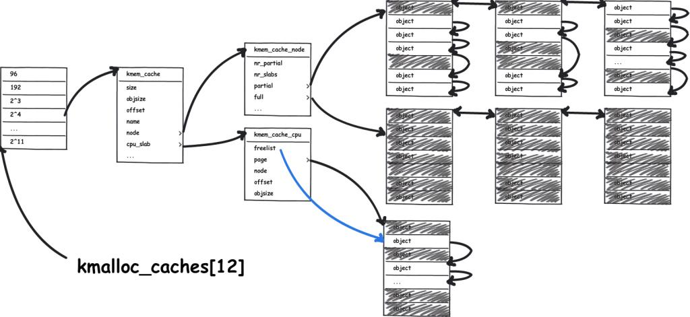
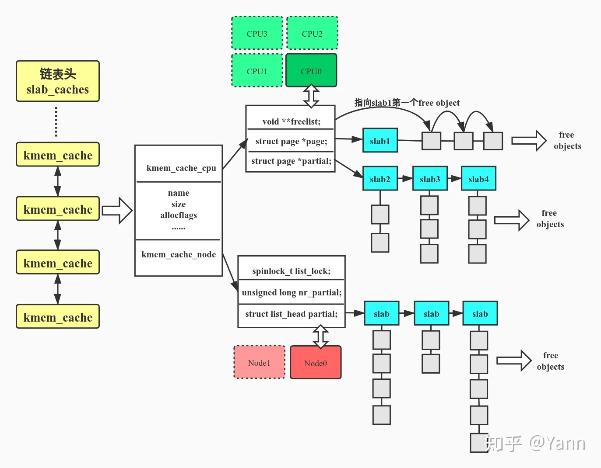

# slub 设计文档

### 简化处

相对于完整的 slub 实现，有以下几点简化：

* 完整版中，1个 slab 可能占有多页，简化版中1个 slab 对应 1 页
* 完整版中，object 是一个完整的结构体，简化版中object由void*代替(具体结构详见后续)
* 完整版中当 partial 状态的 slab 的 $inuse = 0$ 时需要释放slab占有的全部页，简化版没有实现(实际上不是很难，加个判断即可)
* 由于写slub前buddy尚未实现完全，目前 slub 新建一个页由 best_fit 算法代替
* object单位没有 96B 和 192B

### 主要思想

***slub*** 的目的是可以申请比页面大小 (4096) 还小的内存空间，我们称这个单位内存空间为 ***object***，默认最小单位是 $2^3$字节。

由于 ***slub*** 需要通过页面分配算法(通常为Buddy)获取页面，我们把从页面分配算法中获取的页面称作 ***slab***，将 ***slab*** 分割成逐个 ***object***，网上有资料说完整版的 ***slab*** 可以对应多个页面，这里为了简略将一个 ***slab*** 映射到一个页面。

### 结构

如下是 ***slub系统*** 的两个祖传的结构图




***slub系统*** 是四级结构 : 

kmem_cache -> kmem_cache_cpu/kmem_cache_node -> slab -> object

#### kmem_cache

在 ***slub***系统中，每个 kmem_cache 内的 slab 和 object大小固定，如下是其定义：

```c
struct kmem_cache {
  struct kmem_cache_cpu cpu_slab; // 单核CPU，原版是每个CPU一个
	int32_t size; // mem_cache中slab的规格
	int32_t offset; // 页中的空闲slab组成一个链表，在slab中偏移量为offset的地方中存放下一个slab的地址
	uint64_t oo; 
  // oo = order<<OO_SHIFT |slab_num（存在slab占用多个页的情况）
  // 用来存放分配给slub的页框的阶数(批发2^order页)和 kmem_cache中的object数量(低OO_SHIFT位)
	struct kmem_cache_node local_node;
	uint64_t min_partial;
  // 限制struct kmem_cache_node中的partial链表slab的数量。如果大于这个min_partial的值，那么多余的slab就会被释放
};
```

#### kmem_cache_cpu

在分配一个新object时，需要先在kmem_cache_cpu中寻找是否有空余object。

kmem_cache_cpu只有一个slab，当向页面分配算法申请新页面时，会将新页面分配给kmem_cache_cpu这个单独的slab。

```c
struct kmem_cache_cpu {
    void **freelist;   // 指向第一个空闲object的指针
    struct Page *page; // slab/page 起始指针
};
```

#### kmem_cache_node

kmem_cache_node的slab通过链表相连，kmem_cache_node的slab分两种状态:`full`(slab中无空余object)和`partial`(slab中有空余object)。

在分配一个新object时，如果kmem_cache_cpu中没有空余object，那么会将kmem_cache_node的partial slab替换给kmem_cache_cpu，并进行分配，这一性质保证了所有进行分配的object一定位于kmem_cache_cpu中。

如果没有partial slab，即kmem_cache_cpu的slab和kmem_cache_node的所有slab都处于全满状态，那么需要从页面分配算法中重新分配一个页面。

```c
struct kmem_cache_node {
    uint64_t nr_partial;  // partial slab链表中slab的数量 
    uint64_t nr_full;     // full slab链表中slab的数量 
    list_entry_t partial; // partial slab链表表头
    list_entry_t full;    // full slab链表表头
};
```

#### slab

由于经过简化后，一个slab对应一个page，因此直接对结构体Page进行了一些修改，新加入了三个成员变量

```c
struct{
  uint32_t inuse:16;      // 表示非空闲的object的个数
  uint32_t objects:16;    // 该页slab object的上限，即PAGE_SIZE / object_size
};
void *freelist;           // freelist指向第一个空闲object
```

可以看到page和kmem_cache_cpu中都包含freelist，因为一个kmem_cache_cpu对应一个 ***slab***，当 当前 ***slab*** 位于kmem_cache_cpu时，`page->freelist`无需更新维护。

#### object

设计的object结构如下：


`offset` 是指针相对于 ***object*** 首地址的偏移量，当想访问当前slab中的下一个空闲 ***object*** 时，只需要访问 `(object+s->offset)`内存储的指针即可(代码里有些`s->offset>>8`是因为定义的 ***object*** 是`void**`类型，此时偏移量应该除以 `sizeof(void*)`)。

每次分配 ***object***时，需要同步更新 kmem_cache_cpu 的`free_list`。当`(object+s->offset)`内存储的指针为空时，说明当前 ***object*** 为最后一个空闲 ***object***。

### 初始化

初始化主要初始化每个kmem_cache的`size`和kmem_cache_node的链表尾。

### 分配( $alloca$ )

(分配的图片都来源于[祖传参考博客](https://blog.csdn.net/lukuen/article/details/6935068))

分配的步骤:

1. 第一次向`kmem_cache`申请，目前的`kmem_cache`中没有slab，需要在`kmem_cache_cpu`中新建一个slab，使用 Buddy分配算法 获取一个 4096 大小的页面，并分配第一个 ***object*** (返回第一个 ***object*** 的地址，并修改`kmem_cache_cpu`的 `freelist`)

2. `kmem_cache_cpu`中有空闲 ***object***(`kmem_cache_cpu->freelist`不为空)，直接进行分配即可。

3. `kmem_cache_cpu`中没有空闲 ***object***(`kmem_cache_cpu->freelist`为空)，且`kmem_cache_node`有状态为`partial`的 slab，取任意一个状态为`partial`的 slab替换`kmem_cache_cpu`的slab，并进行分配，同时将`kmem_cache_cpu`的原slab移动到`kmem_cache_node`的 `full` 列表中 

4. `kmem_cache_cpu`中没有空闲 ***object***(`kmem_cache_cpu->freelist`为空)，且`kmem_cache_node`没有状态为`partial`的 slab。将`kmem_cache_cpu`的原slab移动到`kmem_cache_node`的 `full` 列表后，重复步骤1

### 释放( $free$ )

释放比较简单，有下面两个注意事项：

* 将`kmem_cache_node`的 `full` 列表中的 ***object*** 释放后，需要将所在 slab 移动到 `partial` 列表中
* 将`kmem_cache_node`的 `partial` 列表中的 ***object*** 释放后，需要判断所在 slab 是否全空(所有 ***object*** 均空闲)，如果全空，需要释放当前 slab 所在的 page

### 样例


1. (图中地址有误)


2. 


3. 


4. 
