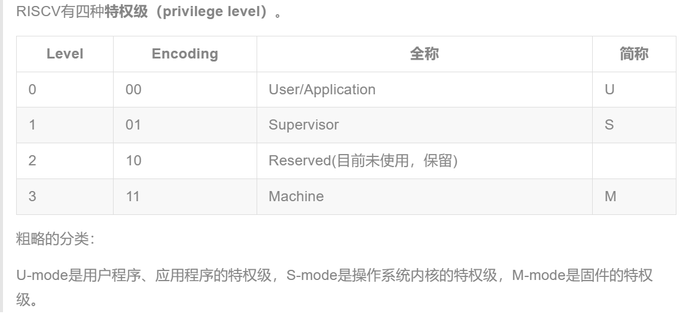
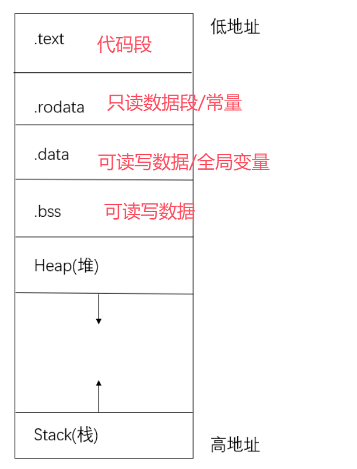
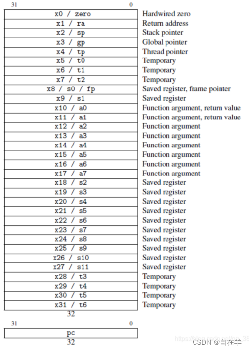
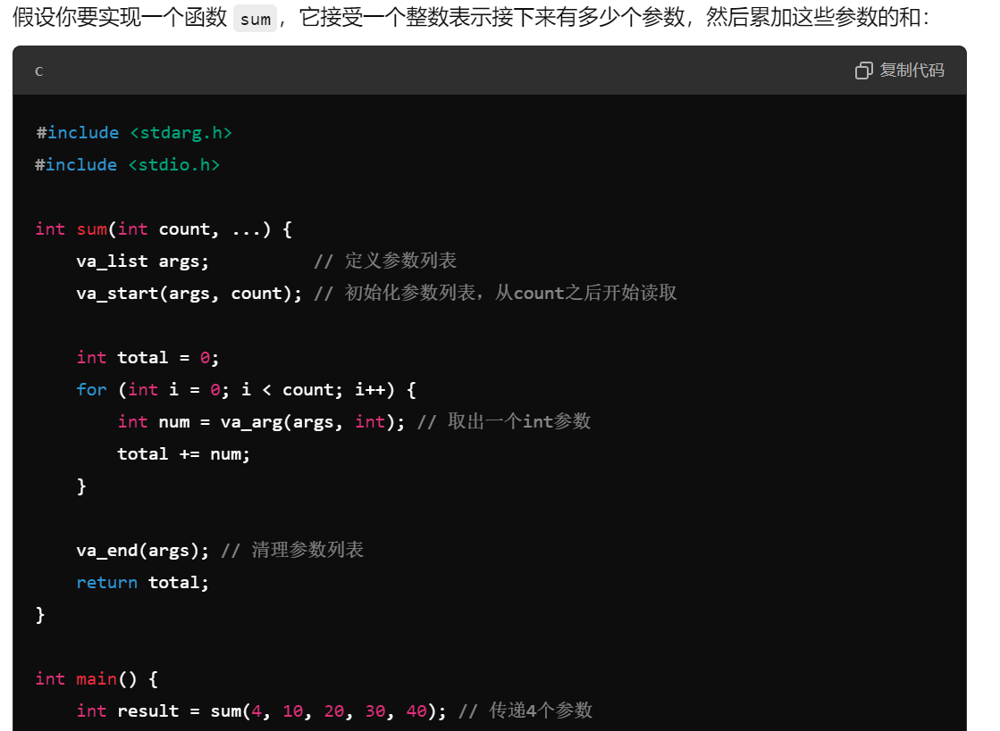

# Lab 0.5

## Questions

* 为了熟悉使用qemu和gdb进行调试工作,使用gdb调试QEMU模拟的RISC-V计算机加电开始运行到执行应用程序的第一条指令（即跳转到0x80200000）这个阶段的执行过程，说明RISC-V硬件加电后的几条指令在哪里？完成了哪些功能？要求在报告中简要写出练习过程和回答。

1. 上电后，`pc`寄存器在 $0x1000$ 的位置，使用指令```x/10i $pc```查看上电后即将执行的指令

```riscv
   0x1000:      auipc   t0,0x0
   0x1004:      addi    a1,t0,32
   0x1008:      csrr    a0,         ;csrr从机器层硬件线程 ID 寄存器读取当前的硬件线程 ID
   0x100c:      ld      t0,24(t0)   ;加载从t0+24中加载双字数据
   0x1010:      jr      t0
   0x1014:      unimp
   0x1016:      unimp
   0x1018:      unimp
   0x101a:      0x8000
   0x101c:      unimp
```

* 逐行运行汇编后，`pc`寄存器跳转到 $0x80000000$

2. 查看 $0x80000000$ 位置的信息，同样使用```x/20i```查看 `pc` 寄存器附近的指令，这里已经进入了内核操作

```riscv
   0x80000000:  csrr    a6,mhartid
   ; 从mhartid寄存器读取当前硬件线程ID
   0x80000004:  bgtz    a6,0x80000108
   ; 线程ID大于零则跳转到0x80000108，当热启动时线程ID大于零
   0x80000008:  auipc   t0,0x0
   0x8000000c:  addi    t0,t0,1032
   0x80000010:  auipc   t1,0x0
   0x80000014:  addi    t1,t1,-16
   0x80000018:  sd      t1,0(t0)
   0x8000001c:  auipc   t0,0x0
   0x80000020:  addi    t0,t0,1020
   0x80000024:  ld      t0,0(t0)
   0x80000028:  auipc   t1,0x0
   0x8000002c:  addi    t1,t1,1016
   0x80000030:  ld      t1,0(t1)
   0x80000034:  auipc   t2,0x0
   0x80000038:  addi    t2,t2,988
   0x8000003c:  ld      t2,0(t2)
   0x80000040:  sub     t3,t1,t0
   0x80000044:  add     t3,t3,t2
   0x80000046:  beq     t0,t2,0x8000014e
   0x8000004a:  auipc   t4,0x0
```

* 这段汇编的作用有 : 判断冷热启动； 初始化栈帧和数据结构；

3. 在 $0x80200000$ 部分正式进入 `kern_entry`

```riscv
   0x80200000 <kern_entry>:     auipc   sp,0x3 ; before : sp = 0x8001bd80      
   0x80200004 <kern_entry+4>:   mv      sp,sp  ; sp = 0x80203000
   ; 0x3 = align(0x1) + KSTACKSIZE(0x2)
   0x80200008 <kern_entry+8>:   j       0x8020000a <kern_init>
   0x8020000a <kern_init>:      auipc   a0,0x3
   0x8020000e <kern_init+4>:    addi    a0,a0,-2
   0x80200012 <kern_init+8>:    auipc   a2,0x3
   0x80200016 <kern_init+12>:   addi    a2,a2,-10
   0x8020001a <kern_init+16>:   addi    sp,sp,-16
   0x8020001c <kern_init+18>:   li      a1,0
   0x8020001e <kern_init+20>:   sub     a2,a2,a0
```
## Notes

### 0.1

1. 最小可执行内核的作用

* 内核的内存布局和入口点设置

* 通过 sbi 封装好输入输出函数

2. 启动操作系统的流程

    简易来讲，最小可执行内核的执行流为：加电 -> OpenSBI启动 -> 跳转到 0x80200000 (kern/init/entry.S）->进入kern_init()函数（kern/init/init.c) ->调用cprintf()输出一行信息->结束。`cprintf()`函数的执行流为:接受一个格式化字符串和若干个需要输出的变量作为参数 -> 解析格式化的字符串，把需要输出的各种变量转化为一串字符 -> 调用`console.c`提供的字符输出接口依次输出所有字符(实际上console.c又封装了sbi.c向上提供的OpenSBI接口)

* 得到内存布局合适的 `elf` 文件，转化成 `bin` 文件

* CPU/QEMU启动

* 作为 bootloader 的 `OpenSBI.bin` 被加载到物理内存以物理地址 $0x80000000$ 开头的区域上，同时内核镜像 `os.bin` 被加载到以物理地址 $0x80200000$ 开头的区域上

* 操作系统的二进制可执行文件( `elf` 或 `bin` )被OpenSBI加载到内存中，然后 OpenSBI 会把 CPU 的 `pc` 寄存器跳转到内存里的位置(QEMU镜像 $0x80200000$)，开始执行内核第一条指令

3. 固件(firmware)为设备的特定硬件提供低级控制，也可以进一步加载其他软件。在基于 ***x86*** 的计算机系统中, BIOS 或 UEFI 是固件；在基于 ***riscv*** 的计算机系统中，OpenSBI 是固件。OpenSBI运行在 `M` 态（M-mode），因为固件需要直接访问硬件。



4. 为什么内核要被加载到 $0x80200000$ 的位置？ 代码的地址相关性, 指令中的访存信息在编译完成后即已成为绝对地址, 在运行之前，自然需要将所需要的代码加载到指定的位置。

5. `elf` 和 `bin` 文件的区别。

* `elf` 文件包含一个文件头，指定程序每个section的内存布局，需要解析program header才能知道各段(section)的信息，`bin` 文件解释加载的起始位置

*  大数组在 `elf` 文件里是 `bss` 数据段的一部分，可以认为bin文件会把elf文件指定的每段的内存布局都映射到一块线性的数据里，这块线性的数据（或者说程序）加载到内存里就符合elf文件之前指定的布局。

### 0.2

1. 程序空间结构图



2. ALIGN($0x1000$) : 进行地址对齐，将 "."增加到 2的0x1000次方的整数倍，也就是下一个内存页的起始处

3. 需要看懂entry.S

### 0.4

1. ecall(environment call)，当我们在 `S` 态执行这条指令时，会触发一个 ecall-from-s-mode-exception，从而进入 `M` 模式中的中断处理流程（如设置定时器等）；当我们在 `U` 态执行这条指令时，会触发一个 ecall-from-u-mode-exception，从而进入 `S` 模式中的中断处理流程（常用来进行系统调用）

2. 可能会有汇编中不同 `x` 寄存器的用途  




3. 在 `printfmt.c` 文件中涉及到了 `scanf` 和 `printf` 的实现，需要学习可变参数的使用



